<h1>Proyecto final - Electrónica Digital 1 - 2025-I</h1>

<h1>Integrantes</h1>
<ol>
<li>Óscar Andrés Moreno Díaz</li>
<li>Ángel Gabriel Jiménez ROmero</li>
<li>Jonathan Steven Godoy Mora</li>
</ol>

<h1>Nombre del proyecto</h1>
<h1>CALCULADORA QUANTIX</h1>
<h2>Abstract</h2>

Una calculadora es una herramienta extremadamente útil para la implementación y realización de diversas operaciones matemáticas de diferente tipo e intensidad. La fabricación y diseño de una herramienta de este calibre representa un afianzamiento íntegro de los conceptos aprendidos en un tiempo.

<h3>Palabras clave</h3>

<em>Cyclone IV, Calculadora, Máquina de Estados Finitos, FPGA, Operaciones Aritméticas</em>

<h2>Introducción</h2>

El uso cotidiano de una calculadora en el mundo moderno ha estado representado de diferentes maneras a lo largo del tiempo desde la invención y fabricación de la primera calculadora digital.

Alrededor del mundo existen varios tipos de calculadoras que funcionan para diferentes aplicaciones en distintos ámbitos de la vida de las personas. Desde las calculadoras más básicas, también conocidas como <em>"calculadoras panaderas"</em>, las cuales solo hacen las operaciones aritméticas básicas (adición, sustracción, multiplicación y división), y operaciones de porcentaje, hasta las calculadoras más avanzadas al día de hoy, las cuales son capaces de realizar cálculos complejos, profundizando en ecuaciones diferenciales y hasta tienen funciones para realizar la representación gráfica de la función que se desee.

Para la presentación de este caso, se realizó en un periodo correspondiente a un semestre académico el ensamble y la construcción de una calculadora que fuera capaz de realizar las 4 operaciones aritméticas básicas, mencionadas anteriormente, utilizando e implementando la tarjeta re-programable <strong>Cyclone IV E</strong>, de la compañía Altera, la cual es comúnmente utilizada en ámbitos de educación en electrónica. Esta calculadora recibió el nombre de <strong>Quantix</strong>, teniendo su origen en la palabra <em>cuántica</em>, la cual es la base para el estudio de materiales y de la física de semiconductores.

<h2>Objetivos del Proyecto</h2>

<h3>Objetivo Principal</h3>

El objetivo principal de la construcción de la calculadora <strong>Quantix</strong> era buscar un valor agregado que tuviera este dispositivo; una plusvalía de la Quantix en el mercado.

<h3>Objetivos Específicos</h3>
<ul>
    <li>
        Diseñar e implementar un sistema digital, el cual realice operaciones matemáticas básicas, como solución práctica en contextos donde no se disponga de herramientas convencionales, garantizando funcionalidad y viabilidad técnica dentro del alcance del proyecto.
    </li>
    <li>
        Construir el sistema que permita el ingreso de datos, su procesamiento mediante la operación homogénea, y la consigna del resultado.
    </li>
    <li>
        Registrar el proceso de desarrollo y las pruebas realizadas para dejar constancia del funcionamiento del sistema dentro del alcance definido.
    </li>
</ul>

<h1>Documentación</h1>

<h2>Descripción de la arquitectura</h2>

De acuerdo con la formación recibida, tomamos este proyecto con la metodología de diseño <em>Top-down</em>, y tuvimos muy en cuenta la parte comportamental de cada subsistema de la calculadora, dado que para el grupo de trabajo, esa fue la clave del correcto funcionamiento de la calculadora en cada módulo.

Se realizaron 10 versiones efectivas de la herramienta, no obstante, únicamente las dos últimas tienen capacidad de cálculo. Las anteriores fueron enfocadas a la representación de datos controlados por el usuario mediante un teclado matricial 4x4.

En la parte comportamental se sabía qué se deseaba realizar y para qué, siendo el "cómo" una cuestión más profunda. Se solicitó ayuda de Inteligencia Artificial para algunas cuestiones de sintaxis. Aunque se tuvo una curva de aprendizaje aceptable para la implementación en la Cyclone IV, el tiempo y la experiencia no fueron suficientes para lograr una escritura totalmente autónoma del código.

La utilización de Inteligencia Artificial alcanzó aproximadamente el <strong>30%</strong> del desarrollo, siendo principalmente usada para el código de la pantalla LCD.

El proyecto comenzó con la exploración del teclado matricial. Se experimentó con las combinaciones de pines recomendadas en el Pin-Out, observando el comportamiento de las filas (F0–F3) al energizar columnas (C0–C3). Se descubrió que si se energiza C0, por ejemplo, F0 se activa al oprimir teclas específicas, lo que permitió deducir un método de identificación mediante lógica de escaneo por columnas.

Se programó un <code>case</code> para asociar combinaciones únicas de Cx y Fx con cada tecla. Sin embargo, se presentaron problemas de estabilidad y falsa digitación. Para mitigarlo, se incluyó un evento de “tecla válida” y luego un <strong>módulo antirrebote</strong> que estabiliza la señal antes de validarla.

Una vez creado el decodificador, se comenzó a trabajar con los displays de 7 segmentos, lo que ayudó a depurar errores y organizar la entrada de datos, operaciones y controladores como <code>RESET</code> e <code>IGUAL</code>.

Posteriormente, se conectó la pantalla LCD. Este paso requirió múltiples pruebas usando interruptores para entender el funcionamiento del periférico. La sincronización entre teclado y LCD permitió comprender la importancia de los protocolos de comunicación.

Antes de modularizar el código, este consistía en un único archivo de gran tamaño. La modularización ayudó en la organización, pero casi se pierde el avance por no tener respaldos, lo que subraya la importancia del enfoque estructural del diseño.

Ya con la pantalla LCD operativa, se ideó un sistema para que el usuario pudiera corregir operaciones antes de confirmarlas. Esto requería manipular el buffer de la línea F0 del LCD para sustituir códigos antiguos por nuevos.

Al intentar obtener los datos desde el buffer para enviarlos a la ALU, se presentaron errores. Se optó por una arquitectura de doble salida en el decodificador del teclado: una para la pantalla y otra para reconstruir números ingresados y enviarlos al módulo operador al presionar <code>#</code>.

Tras muchas pruebas y dificultades con registros llenándose de valores basura, se refinó este esquema y finalmente se logró una calculadora funcional de <strong>16 bits</strong>, superando la meta original de 8 bits.

<h2>Diagramas de la arquitectura</h2>
<h3>Arquitectura Lógica Aplicada</h3>

Tanto para el ingreso y la consigna de datos, como para las diferentes operaciones, es importante entender el comportamiento lógico del sistema. A continuación, se presentan las FSM (Máquinas de Estados Finitos) utilizadas.

<strong>Estructura General de la ALU:</strong>

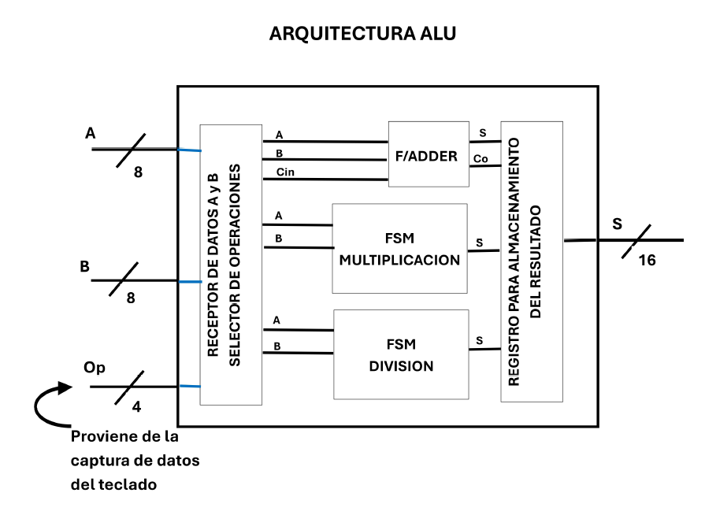

<em>Figura 1: Estructura General de la ALU</em>

<strong>Captura de Datos General:</strong>

<em>Figura 2: Captura de Datos General</em>

<strong>Ingreso del Primer Dato:</strong>

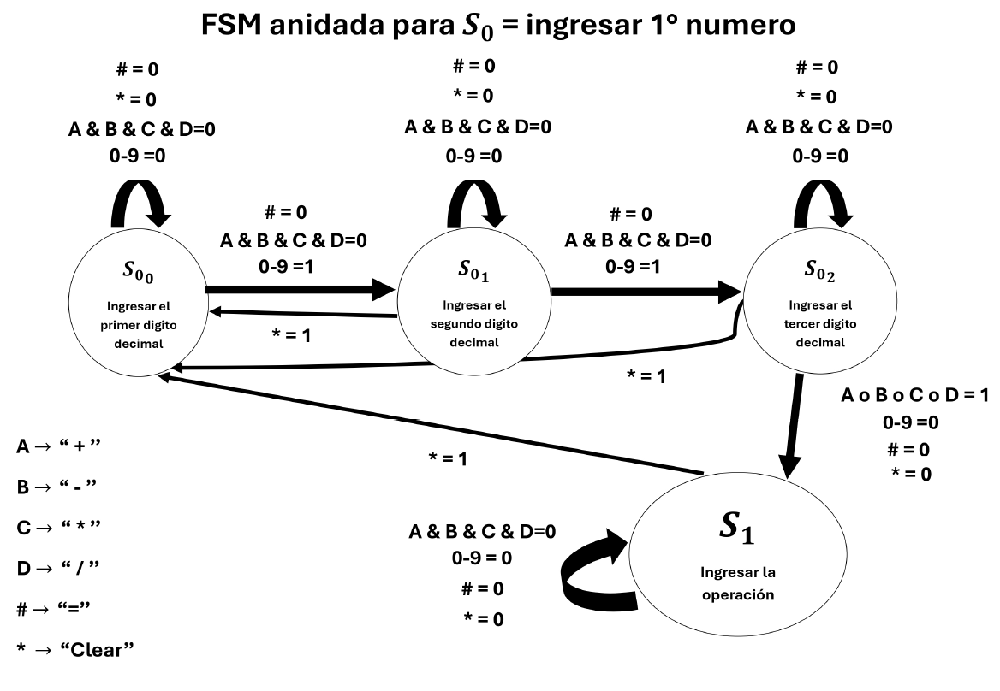

<em>Figura 3: Ingreso del Primer Dato a la Quantix</em>

<strong>Ingreso del Segundo Dato:</strong>

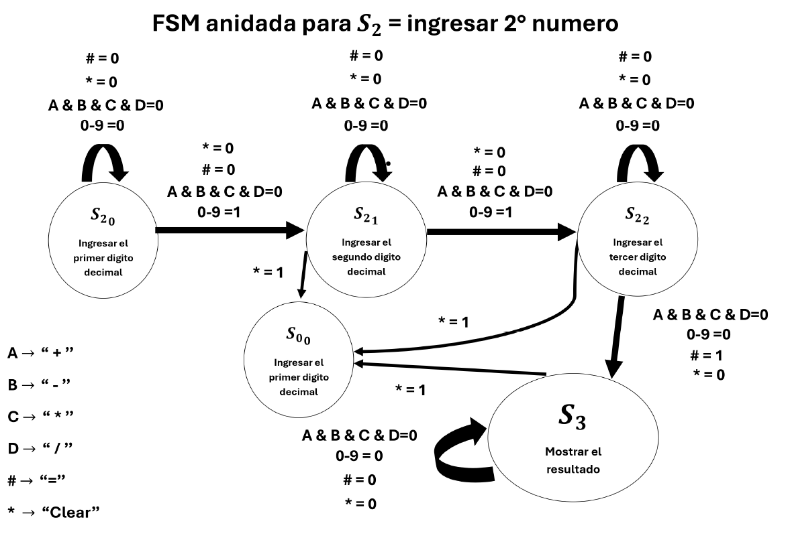

<em>Figura 4: Ingreso del Segundo Dato a la Quantix</em>

Para la adición y sustracción se utilizaron módulos de sumadores/restadores. Las operaciones de multiplicación y división requerían FSM dedicadas debido a sus particularidades lógicas (por ejemplo, manejar multiplicación por 0 o divisiones con 0).

<strong>Multiplicación de Dos Números:</strong>

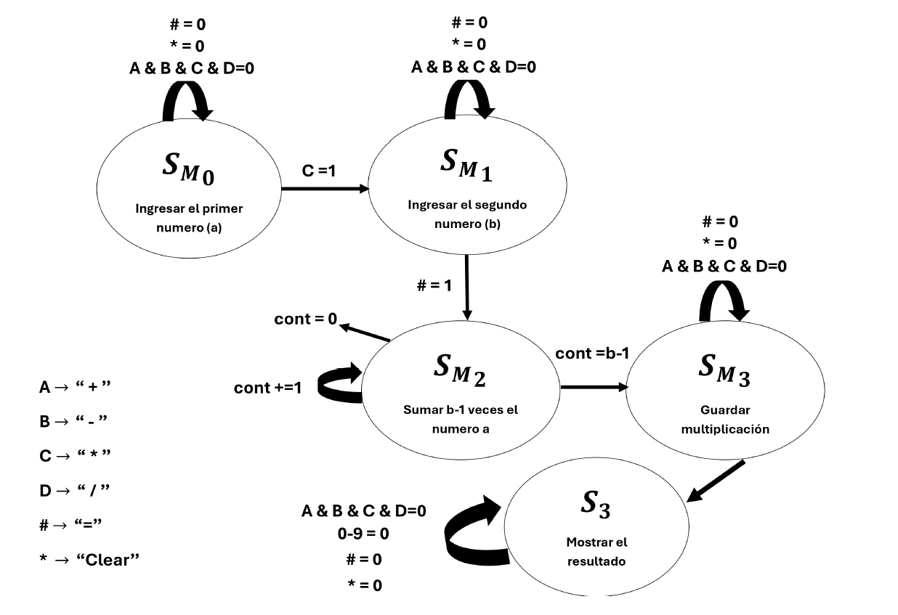

<em>Figura 5: Multiplicación de Dos Números en la Quantix</em>

<strong>División de Dos Números:</strong>

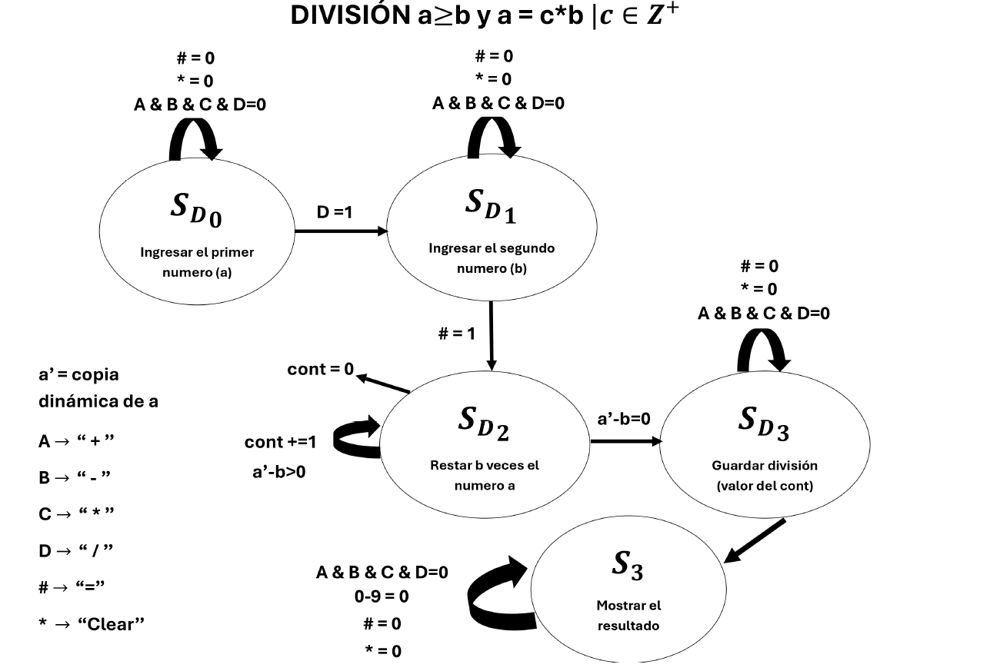

<em>Figura 6: División de Dos Números en la Quantix</em>

Estas FSM fueron fundamentales para implementar tanto los pasos básicos como los avanzados del sistema de cálculo de la Quantix.

<h2>Simulaciones</h2>

La parte de las simulaciones siempre fue consignada por medio de Icarus Verilog. Cada módulo empleado era registrado, corregido (según el caso), y verificado para su correcta implementación en el programa de Quartus

Para una mejor ilustración, se presenta el módulo base de toda la implementación para la creación de la calculadora, la cual cuenta con todas las instanciaciones necesarias para la correcta implmentación del trabajo total en la calculadora Quantix:

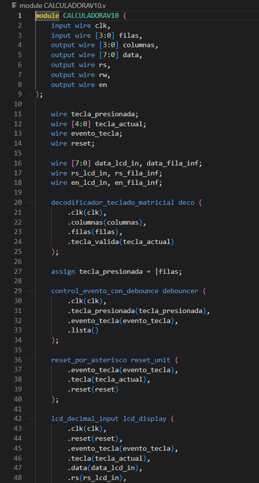
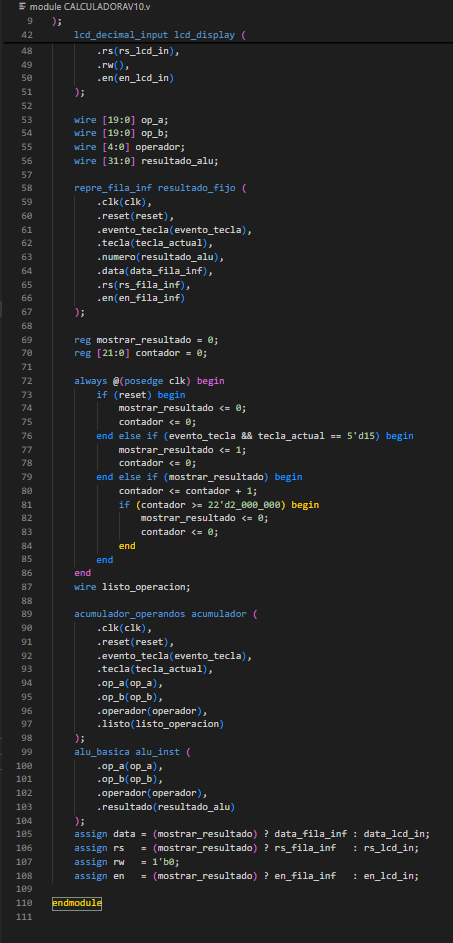

<h2>Implementación</h2>
  <h2>Montaje e Implementación</h2>
  

    Para la parte del Montaje y la Implementación física de la calculadora Quantix, relatándose en la sección anterior, fueron utilizados periféricos externos a la Cyclone IV, como un teclado matricial y una pantalla LCD, todo con sus respectivos puentes de conexión y pines en asignación.
  

  

    A continuación, se presentarán los elementos periféricos utilizados en la construcción física de la calculadora Quantix:
  

  <figure id="Teclado">
    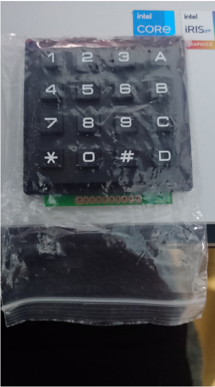
    <figcaption>Teclado Matricial 4X4</figcaption>
  </figure>

  <figure id="LCd">
    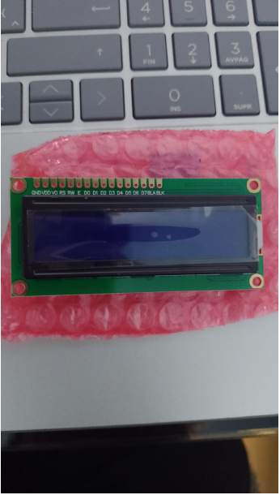
    <figcaption>Pantalla LCD 16X2</figcaption>
  </figure>

  

    Continuando de manera breve, como se consignó en la sección de <em>Lógica de Arquitectura y Construcción</em>, se utilizó la tarjeta re-programable Cyclone IV de Altera, la cual se convirtió en el cerebro de la implementación y el principal elemento de estudio para la fabricación y construcción física de la Quantix. A continuación, se presentarán una serie de imágenes consignando la forma física de la calculadora, y en la realización de un par de operaciones:
  

  
Se consigna la operación de adición:

  <figure id="Adición">
    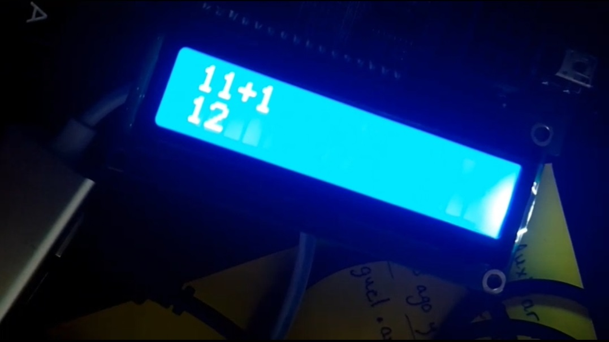
    <figcaption>Adición de 11+1=12</figcaption>
  </figure>

  
Se consigna la operación de sustracción:

  <figure id="Sustracción">
    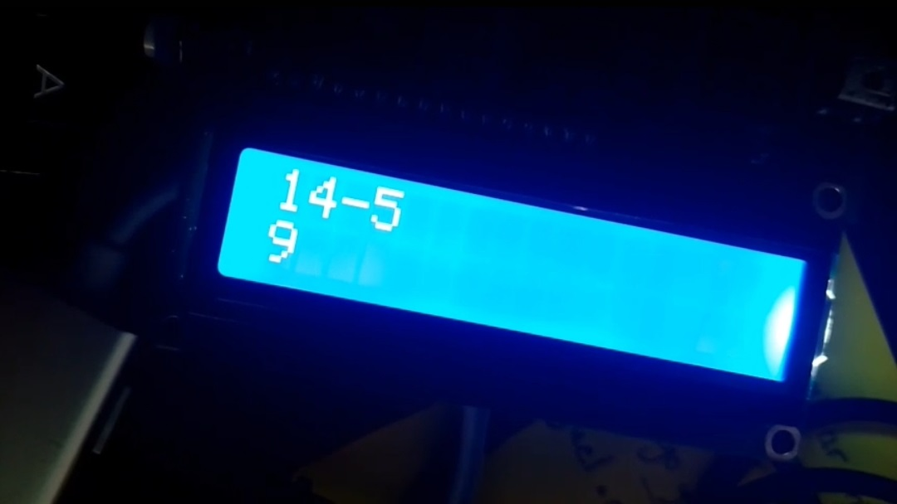
    <figcaption>Sustracción de 14-5=9</figcaption>
  </figure>

  
Se consigna la operación de multiplicación:

  <figure id="Multiplicación">
    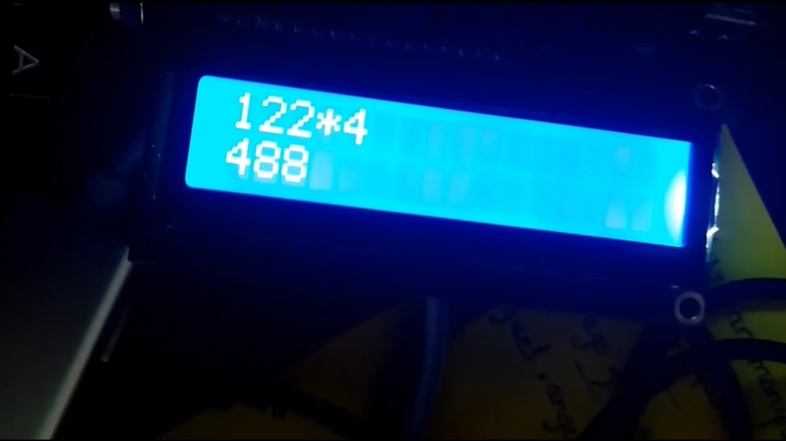
    <figcaption>Multiplicación de 122*4=488</figcaption>
  </figure>

  
Se consigna la operación de división:

  <figure id="División">
    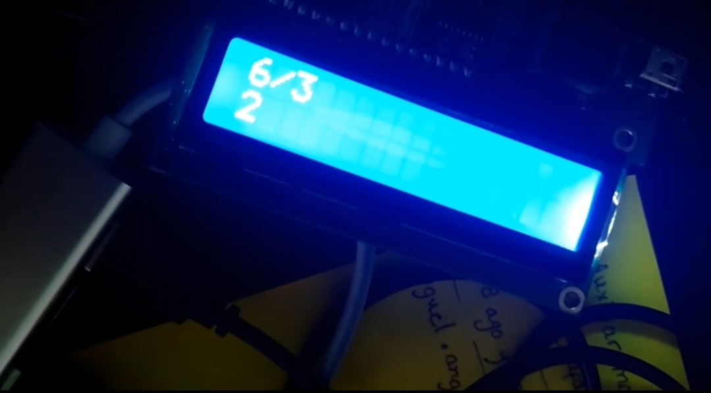
    <figcaption>División de 6/3=2</figcaption>
  </figure>

  
Las imágenes anteriores son la prueba tangible del funcionamiento correcto de la calculadora Quantix.

</section>
<h2>Conclusiones</h2>
  <ul>
    <li>La calculadora Quantix sí puede llegar a obtener un valor agregado en el mercado general, gracias a su fabricación y construcción, a pesar de que inicialmente pueda ser complicado.</li>
    <li>Se garantizó funcionalidad y viabilidad técnica en el proyecto dentro de las limitaciones físicas y de software posiblemente presentes.</li>
    <li>Se logró un procesamiento, impresión, operación y resultado de diferentes operaciones a realizar de manera homogénea, referenciando la garantía de correcta funcionalidad.</li>
    <li>Se evidenció por completo el proceso de construcción y arquitectura, llevando a procesos de pensamiento enteramente complejos.</li>
  </ul>
</section>
<h2>Referencias Bibliográficas</h2>
  <ol>
    <li>
      Altera Corporation. “Cyclone IV FPGA Device Family Overview,” 2016, <em>Cyclone IV Device Handbook</em>, Volume 1.
    </li>
    <li>
      E. Tlelo-Cautle, J. d. J. Rangel Nagdaleno, y L. G. De la Fraga. <em>Engineering Applications of FPGA’s</em>. Springer, 2016.
    </li>
    <li>
      Altera Corporation. <em>Cyclone IV GX FPGA Development Board Reference Manual</em>, 2015. [En línea] Disponible en: 
      <a href="https://www.fpgakey.com/uploads/files/downloadfile/20231218/034025rm_civgx_fpga_dev_board.pdf" target="_blank">
        fpgakey.com
      </a>
    </li>
    <li>
      E. De Lucas Casamayor. “Metodología de síntesis para uso de bloques DSP con HDL sobre FPGAs.” <em>Tesis de maestría</em>, Facultad de Informática, Universidad Complutense de Madrid, 2011.
    </li>
  </ol>
</section>

