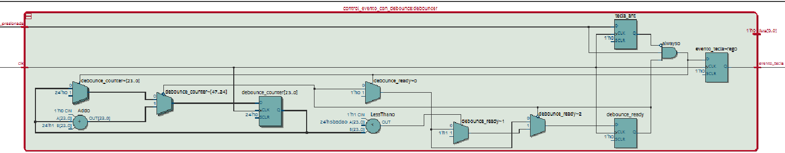

# Proyecto final - Electrónica Digital 1 - 2025-I
=======

<h1>Proyecto final - Electrónica Digital 1 - 2025-I</h1>

<h1>Integrantes</h1>
<ol>
<li>Óscar Andrés Moreno Díaz</li>
<li>Ángel Gabriel Jimenez Romero</li>
<li>Jonathan Steven Godoy Mora</li>

<h1>Nombre del proyecto</h1>
CLACULADORA QUANTIX

<h1>Documentación</h1>
<h2>Descripción de la arquitectura</h2>

La arquitectura general de la calculadora Quantix cuenta con una forma general que es expuesta de manera super simplificada para un mejor entendimiento. Esta arquitectura muestra como existe la construcción de la Quantix, en cómo esta fue constituida desde la lógica. A continuación, se mostrará la estructura de esta:

Se inicia desde la interacción con el entorno, para luego pasar a la interacción y el entendimiento del funcionamiento del teclado matricial 4X4 utilizado para la consignación de los números en la  calculadora, la reconstrucción de los números, el control de la pantalla LCD, la la operación de la ALU como unidad básica de procesamiento central de la calculadora, y la representación de la operación completa en la pantalla LCD, como una operación aritmética básica.

<h2>Diagramas de la arquitectura</h2>

Se presentan en esta sección los diagramas de arquitectura que fueron usados para la construcción de la calculadora Quantix, los cuales fueron consignaods en RTL Viewer de Quartus, cuando se realizó el estudio y la implementación de los códigos de los módulos instanciados en el módulo top, que es el que le da vida a la calculadora Quantix

Se presenta de manera general, la arquitectura de conexión obtenida:

Cada módulo está consignado dentro de esta arquitectura, y cada uno está conectado a elementos con diferentes funciones dentro de la construcción de la calculadora. Se recorrerá brevemente cada módulo.

<h3>Acumulador de Operandos</h3>

El módulo de acumulador de operandos tiene como finalidad capturar y almacenar dos operandos decimales y un operador entre las teclas (+, -, *, /). Cuando se oprime la tecla # para el resultado, se emite una señal, indicando que la operación está lista para ser procesada. Este permite registrar más de un operador.

<h3>ALU Básica</h3>

El módulo de la ALU (Unidad Lógico Aritmética) recibe los operandos y el operador, y en base a eso, genera el resultado correspondiente. Ésta es la que evita la división por cero. El resultado presenta su salida acotada a 32 bits para cubrir multiplicaciones sin desbordamiento.

En este caso solo se presentará el registro utilizado para la ALU, debido a que su estructura interna supera el tamaño requerido para las imágenes.

<h3>Control de Eventos y Rebote</h3>

El módulo del control de eventos y rebote es muy interesante por las razones por las que se construyó. Éste implementa lógica antirrebote para estabilizar la detección de teclas. Solo genera un pulso cuando se genera una transacción limpia, y utiliza un contador interno con un umbral de 120ms, para evitar perturbaciones externas.

Se creó para solucionar el problema del ruido en la señal generado por el registro mecánico de las teclas en el teclado matricial

<h3>Decodificador del Teclado Matricial</h3>

Éste módulo escanea las columnas del teclado de forma secuencial, detecta filas activas en alto y asigna un código específico a cada tecla según su posición física. Así, implementa un mapeo total para el registro correcto de las 16 teclas.

<h3>Control del Display de Pantalla LCD</h3>

Este módulo se encarga de la impresión y el registro de los números y operandos en la primera fila de la pantalla LCD. Realiza la conversión de cada tecla a su equivalente en código ASCII, al igul que reemplaza el operador si este es presionado más de una vez. Se controla por medio de una Máquina de Estados Finitos que sigue el protocolo HD44780 de la LCD

<h3>Registro de Corrimiento</h3>

Aquí se registran las últimas cuatro letras presionadas. También produce una salida plana de un aproximado de 20 bits, concatenando éstas 4 últimas letras, de 5 bits cada una.

Al igual que con la imagen asociada a la UNidad Lógico Aritmética, sus conexiones internas ocupan demasiado espacio físico.

<h3>Función de RESET por Tecla "Asterisco"</h3>

Simplemente mediante la tecla de "asterisco", decodificada por la tecla 14, se genera la señal de reset para limpiar la operación de la pantalla LCD

Todas las imágenes anteriores presentan las conexiones internas de cada módulo instanciado para la construccioón de la Quantix

Después de todo este análisis, se pasó al código del módulo de "CALCULADORAV10", el cual es el que se encarga de las instancias correspondientes en el orden específico, para cumplir con la imagen de la arquitectura general.
 

<h2>Simulaciones</h2>

Las simulaciones realizadas para la construcción de la calculadora no se realizaron por medio de <i>test benches</i> como normalmente se está acostumbrado. No se utilizó el programa Icarus Verilog para estos procesos, sino que se fue probando módulo por módulo directamente en el programa Quartus por medio de las pruebas realizadas con contactos y diodos LED en la tarjeta reprogramable Cyclone IV

<h2>Implementación</h2>

La calculadora Quantix tiene como unidad física central la tarjeta reprogramable Cyclone IV de la compañía Altera, además de contar con un par de periféricos como un teclado matricial de 4X4 que cuenta con 10 números, y 6 teclas con caracteres especiales, a los cuales se les fue asignado una operación específica a cada uno; y una pantalla LCD para poder representar las operaciones de la calculadora cuando estas sean realizadas.

El funcionamiento de la calculadora está en la siguiente secuencia de pasos a seguir:

<ol>
<li>Ingresar el primer número deseado a operar</li>
<li>Ingresar la operación a realizar</li>
<li>Ingresar el segundo número deseado a operar</li>
<li>Oprimir la tecla correspondiente a la impresión del resultado</li>
<li>Oprimir la tecla correspondiente al RESET en operación para limpiar la pantalla</li>
<li>Volver al paso inicial</li>